# Setting Up LEMP on Ubuntu with Nginx
## Introduction
This project explains how to set up a LEMP stack (Linux, Nginx, MySQL/MariaDB, and PHP) on Ubuntu. It covers installing and configuring each component to serve dynamic websites efficiently using Nginx as the web server. By following these steps, you’ll have a fully functional environment for hosting PHP-based applications.

---
## Prerequisites
- AWS account (EC2 access)
- Basic Linux knowledge
- SSH key pair
- Security group: ports 80 (HTTP), 22 (SSH)
- Ubuntu EC2 instance
- Basic knowledge of Nginx, MySQL, PHP
---
## Steps to Deploy LEMP Stack

### Step 1: Login into AWS Account and Launch Ec2 Instance
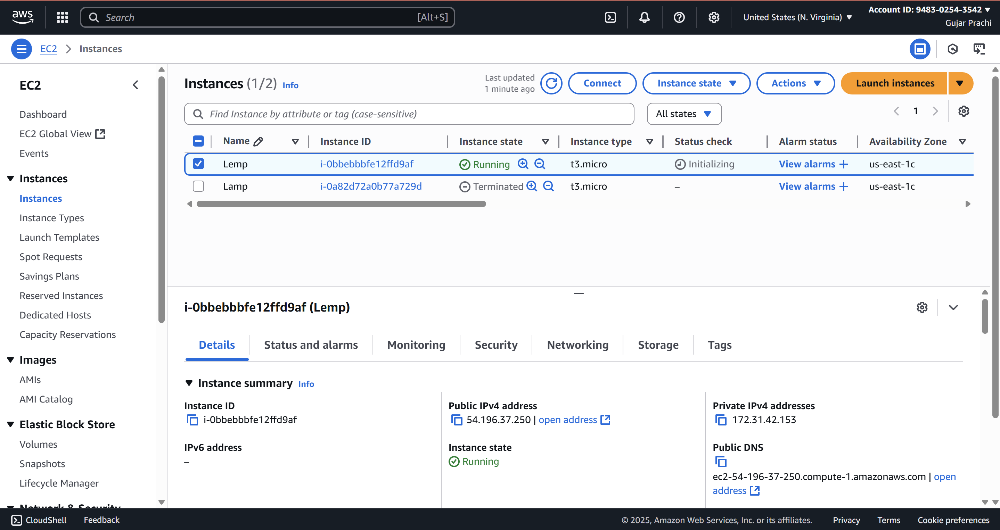
### Step 2: Establish a secure SSH connection to your EC2 instance and update the system packages.
- Copy the SSH connection command from the SSH client and paste it into Git Bash to connect to the instance.
```bash 
# to update
sudo apt update 
```
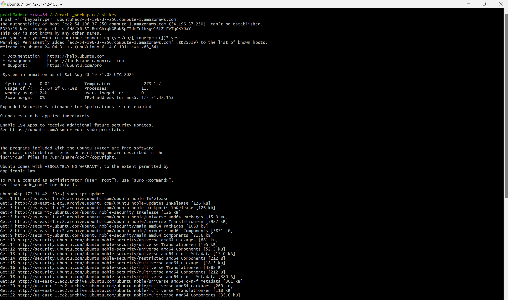
### Step 3: Install the Nginx webserver.
```bash
# to install nginx
sudo apt install nginx -y
```
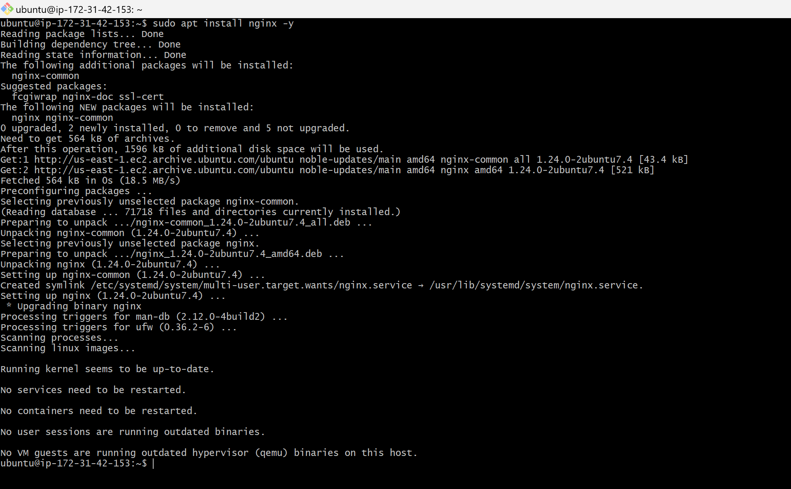
### Step 4: Install MySQL.
``` bash
# to install mysql
sudo apt install mysql-server 
```
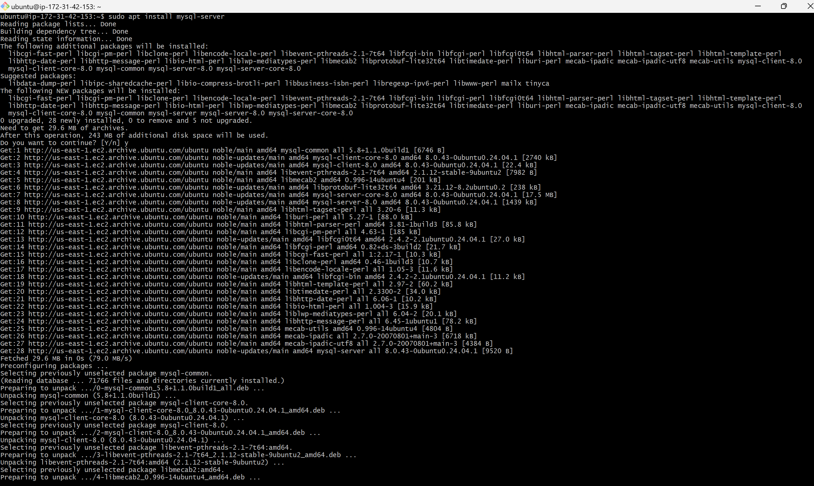
### Step 5: Install PHP and FPM
``` bash
# to check the PHP version
php --version
```
``` bash
# to install php-fpm
sudo apt install php8.3-fpm 
```
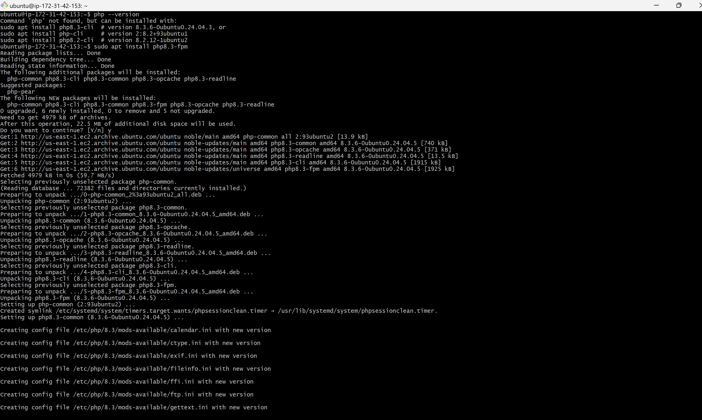
### Step 6: Start, enable, and check the status of Nginx, MySQL, and PHP-FPM.
``` bash
# to start
sudo systemctl start nginx mysql php8.3-fpm 
```
``` bash
# to enable
sudo systemctl enable nginx mysql php8.3-fpm 
```
``` bash
# to check the status
sudo systemctl status nginx mysql php8.3-fpm 
```
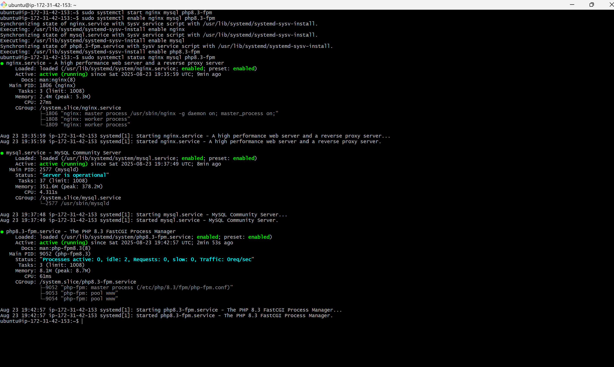
### Step 7: Navigate to Nginx's default directory and create the files index.html and index.php.
``` bash
# to navigate to default directory
sudo /var/www/html
```
``` bash
# to create file
sudo vim file_name
```
``` bash
# to view the code
cat file_name
```
```bash
#to restart and to verify the applied changes 
sudo systemctl restart nginx mysql php8.3-fpm
```
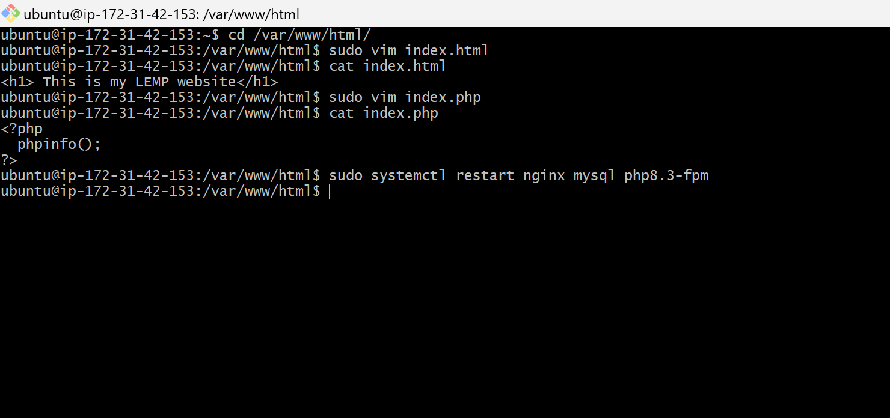
### Step 7: Copy the public IP address and paste it into the browser to access the website.
- The index.html file is the default page.
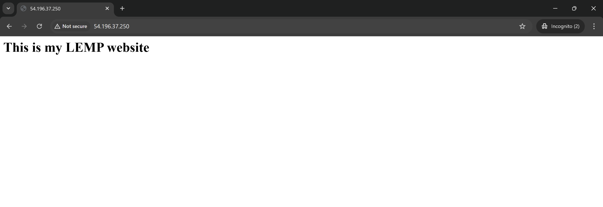
- To view the PHP page, enter publicip/index.php in the URL bar, but note that instead of displaying, the file will be downloaded.
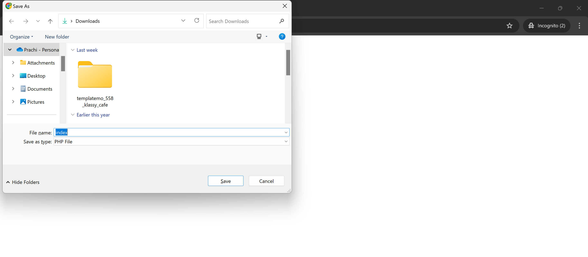
### Step 8: Edit the Nginx default site configuration to prevent the PHP file from being downloaded and display the index.php page in the browser.
```bash
#to navigate nginx configuration file path
cd /etc/nginx/sites-enabled/default/
```
```bash
#to open default file
sudo vim default
```
- In the default file, locate the second location block (currently commented), uncomment the necessary lines, and update the PHP version to the current version within the same block.
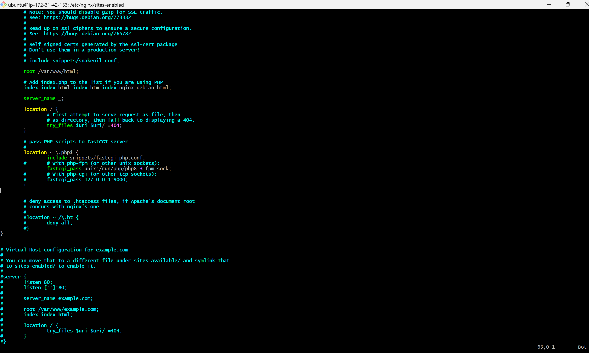
```bash
#to restart and to verify the applied changes 
sudo systemctl restart nginx mysql php8.3-fpm
```
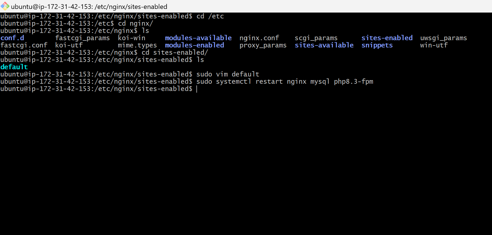
### Step 9: Verify that index.php is correctly deployed by accessing it via the server’s IP in a browser.
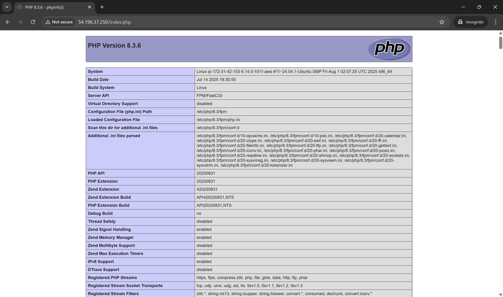
---
## Summary
This project provides a step-by-step process to set up a LEMP stack (Linux, Nginx, MySQL/MariaDB, PHP) on an Ubuntu EC2 instance. It covers installation, configuration, and deployment of dynamic PHP websites, including editing Nginx settings to properly serve index.php. By following these steps, users can host PHP-based applications efficiently on Nginx.
